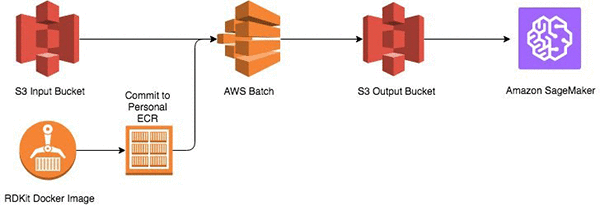

# rdkit-preprocess

- AWS ブログに掲載されている，[化合物溶解度予測ワークフロー](https://aws.amazon.com/jp/blogs/news/build-an-online-compound-solubility-prediction-workflow-with-aws-batch-and-amazon-sagemaker/) を実行するための手順書です
- 元のブログでは説明や記述が足りていないため，こちらで実行可能な形にまとめました

## 全体像

以下のような形になります．これらのうち，ジョブ実行用のコンテナについては，すでにこちら側で作成したものを使って行います．コンテナイメージの中身については，container/ ディレクトリをご確認ください．



## AWS Batch による前処理

### S3 バケットの作成

- S3 のページに行って，左上の [バケットを作成する] を選択して設定のポップアップを開く
- バケット名に `rdkit-preprocess-output-YYYYMMDD-XX` と入力
    - YYYYMMDD は今日の日付を入力
    - XX は割り当てられた番号を入力．XX については，以降すべて同様に，割り当てられた番号に置き換える
- 左下の [作成] を押して，バケットを作成

### IAM ロールの作成

#### AWS Batch の実行用ロールを作成

- まず AWS Batch の実行に必要な IAM ロールを準備します
- IAM のページに行って，左側メニューの [ロール] から [ロールの作成]，AWS サービス] の順に選択して，[Batch] を選んだら [次のステップ: アクセス権限] に進みます
- そのまま[次のステップ: 確認] を押して，ロール名に `batch-rdkit-role` と入力し，[ロールの作成] を押します．これでロールが作成されました

#### ECS インスタンスにアタッチするロールを作成

- 続いて，もうひとつ IAM ロールを作成します
- 左側メニューの [ロール] から [ロールの作成]，AWS サービス] の順に選択して，[Elastic Container Service]，続いて [EC2 Role for Elastic Container Service] を選んだら [次のステップ: アクセス権限] に進みます
- そのまま[次のステップ: 確認] を押して，ロール名に `ecs-rdkit-role` と入力し，[ロールの作成] を押します．これでロールが作成されました
- その次に，ロールの一覧から作成したばかりの `ecs-rdkit-role` を選択し（数が多くてよくわからない場合は，上の検索窓に `ecs` などをいれて絞る），[アクセス権限] タブから [ポリシーのアタッチ] を選択して，[AmazonS3FullAccess] を選んで [ポリシーのアタッチ] を押す（先ほどと同様に，検索窓に適当なキーワードを入れて表示を絞る）

### バッチジョブのセットアップ

#### コンピューティング環境の作成

- 次に，AWS Batch のページに行って，左メニューの [コンピューティング環境] を選択し，[環境の作成] ボタンを押す
- 設定画面で，次の部分を記入して，[作成] を押す
    - コンピューティング環境の名前: `batch-rdkit-environment-XX`
    - サービスロール: 上で作成した `batch-rdkit-role` を選択
    - インスタンスロール: 上で作成した `ecs-rdkit-role` を選択
    - 必要な vCPU: 2 を指定

#### ジョブキューの作成

- 続いて左メニューの [ジョブキュー] を選択して，[キューの作成] ボタンを押す
- 設定画面で，次の部分を記入して [作成] を押す
    - キュー名: `batch-rdkit-queue-XX`
    - 優先度: 1
    - コンピューティング環境を選択: 先ほど作成した `batch-rdkit-environment-XX` を選択

#### ジョブ定義の作成

- 左メニューの [ジョブ定義] を選択して，[作成] ボタンを押す
- 設定画面で，次の部分を記入して [ジョブ定義の作成] を押す
    - ジョブ定義名: `batch-rdkit-job-defnition-XX`
    - イメージ: 666254511816.dkr.ecr.ap-northeast-1.amazonaws.com/rdkit/preprocess
    - コマンド: `python /data/mp_calculate_descriptors.py`
    - 環境変数: 以下の 2 つを作成
        - `INPUT_SMILES_S3`: `rdkit-preprocess-input`
        - `OUTPUT_SMILES_S3`: 先ほど作成した S3 バケット名を入力

### バッチジョブの実行

- 左メニューの [ジョブ] を選択して，[ジョブの作成] ボタンを押す
- 設定画面で，以下を入力して，[ジョブの送信] を押す
    - ジョブ名: `batch-rdkit-job-XX`
    - ジョブ定義: 先ほど作成した `batch-rdkit-job-defnition-XX` を選択

### 結果の確認

- S3 のページにいって，先ほど作成したバケットを開いてください
- `f9e8890b-90ed-450f-859c-a4e007390e30_smiles_result.csv` のようなファイルがあれば，処理が完了しています　
- この結果を使って，続いて SageMaker で簡単な機械学習のモデルを作成します

## SageMaker で機械学習を実行

### ノートブックインスタンスのセットアップ

- SageMaker のページに行って，左メニューのノートブックインスタンスを選択
- 右側 [ノートブックインスタンスの作成] を押して設定画面を開き，以下の内容を入力して [ノートブックインスタンスの作成] ボタンを押します
    - ノートブックインスタンス名: `sagemaker-rdkit-notebook-XX`
    - IAM ロール: 以下の手順で新しいロールを作成
        - [新しいロールの作成] を選択
        - [指定する S3 バケット] で [任意の S3 バケット] を選ぶ
        - [ロールの作成を押す
- 数分待つと，作成したインスタンスが `InService` になるので，右側の [オープン] を押して Jupyter Notebook を開く

### ノートブックの準備

- 右側 [New] から [Terminal] を選択して，ターミナル画面を立ち上げる
- ターミナル画面で，以下のコマンドを入力

```
cd SageMaker/
wget https://s3.amazonaws.com/rdkit-preprocess-input/RDKit-S3.ipynb
```

- ノートブックのファイルエクスプローラ画面に戻って，`RDKit-S3.ipynb` を開く
- あとはノートブックを実行していきます

